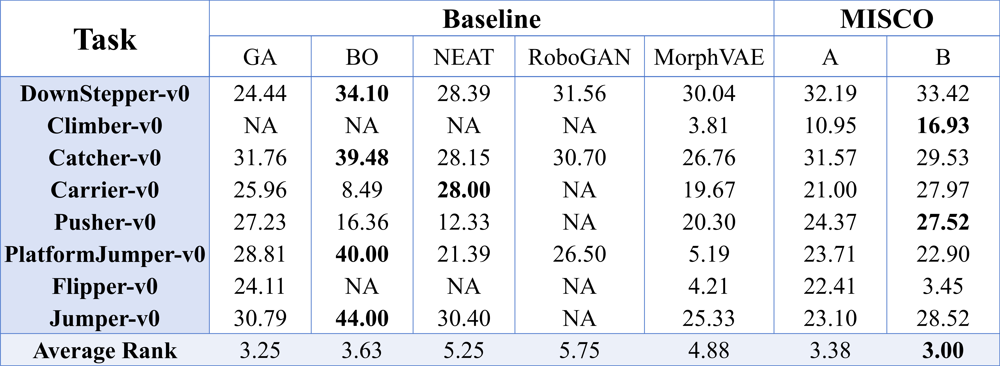
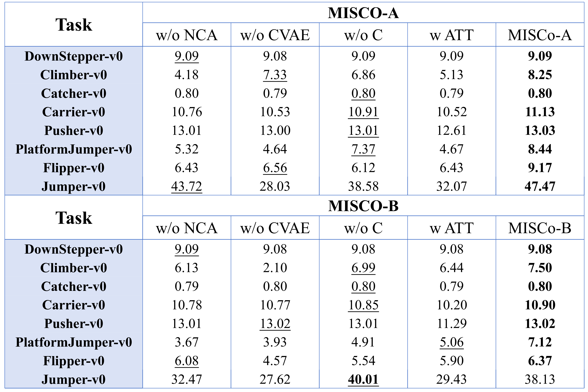

# MISCO (<u>M</u>ulti-task soft robot design automation with <u><strong>I</strong></u>nter-voxel <u>S</u>oft robot design automation with <u>CO</u>ordination)

<p align="center">
  
  <br>
  <em>Figure 1: Algorithm Overview. a, In each generation, MISCO iterates over four stages: (1) Robot proposal by MEC-VAE to generate candidate solutions; (2) Control optimization and fitness evaluation; (3) Natural selection with an adjustable balance between advantage exploitation and biodiversity exploration; (4) Model update based on the selected robot designs to better fit the high-performing morphology distribution. The algorithm then returns to the first stage, and generates a new, hopefully better, population from the shifted distribution. b, The process of robot proposal by MEC-VAE. c, The detail of model update. Given a specific robot morphology and its task type, the approximate posterior (i.e. encoder) infers the latent variable H_t, which is then used to reconstruct a morphological distribution. The evidence lower bound (ELBO) consists of two terms, the reconstruction error and the KL divergence regularizing the approximate posterior towards the prior distribution.</em>
</p>

## 📖 Project Overview

Motivated by the aforementioned limitations, here we propose MISCO, **a novel evolutionary framework that leverages the multi-task optimization capabilities enabled by deep GM-based EDAs for robot design automation**. Specifically, we integrate the **Morphological Evolutionary Conditional Variational Autoencoder** (MEC-VAE), a probabilistic generative model designed specifically for modeling voxel-based soft robots, into a bi-level optimization algorithm.

### Key Features
- 🤖 Automated design of voxel-based soft robots
- 🧠 Morphology-control co-optimization
- 🔄 Multi-task knowledge sharing and transfer
- 📊 Adjustable exploration-exploitation balance strategy

## 🌟 Technical Innovations

### MEC-VAE Architecture

MEC-VAE introduces three key innovations:
1. Task-aware mechanism
2. Position-aware encoding
3. Inter-module coordination system (based on neural cellular automata)

### Algorithm Variants
- **MISCO-A**: Exploitation-focused variant for optimization efficiency
- **MISCO-B**: Exploration-focused variant for morphological diversity

## 📈 Benchmark Tasks

This project includes 8 benchmark tasks:
- Jumper-v0: Jumping task
- Climber-v0: Climbing task
- Carrier-v0: Carrying task
- DownStepper-v0: Down-stepping task
- PlatformJumper-v0: Platform jumping task
- Flipper-v0: Flipping task
- Thrower-v0: Throwing task
- Catcher-v0: Catching task

Here we provide a simple introduction to the task settings accompanied by illustrative images of each task. For readers seeking a deeper understanding of the physical setup and configurations, we recommend referring to Evolution Gym simulation environment.

<p align="center">
  
  <br>
  <em>Illustration of various tasks in the EvoGym environment.</em>
</p>

## 🔬 Evaluation Metrics

### Optimization Efficiency
- **Best Fitness**: Evaluates the optimal solution found by the algorithm
- **Fitness Distribution**: Reflects the overall optimization quality
- **Cumulative Fitness Time Average (CFTA)**: Reflects the algorithm's ability to explore and maintain high-performance morphology designs

### Morphological Diversity
Evaluated using **Morphological Diversity Score (MDS)**:
- MDS = α MV + β MHD, 
where MV is morphological variance, MHD is morphological Hamming distance, α and β are weight coefficients, typically set to 0.5.

## 📊 Experimental Results

### Performance Evaluation
<p align="center">
  
  <br>
  <em>Figure 2: Evaluations of best fitness and cumulative fitness time average (CFTA) during evolution. a, A brief introduction of the selected task instances, including their objectives and difficulty levels. b, Performance comparison of best fitness. Best fitness (vertical axis) is plotted against the cumulative count of up to 1,000 robot evaluations (horizontal axis). c, Performance comparison of cumulative fitness time average (CFTA). CFTA reflects how the average fitness of evaluated robot designs changes as evolution progresses.</em>
</p>

<p align="center">
  
  <br>
  <em>Figure 3: Comparisons of evolutionary outcomes. a, left: Comparative results of eventually achieved best fitness (i.e. best fitness at 1000 evaluations), as well as average ranks of different algorithms across all tasks. The best results are in bold while the best-performing baselines other than MISCo are underlined (the same is true for panel b). a, right: Normalized best-fitness performances showcased in radar plots, with MISCo-A serving as one unit. b, left: Comparative results of average fitness of all evaluated designs, as well as average ranks of different algorithms across all tasks. b, right: Normalized average-fitness performances showcased in radar plots, with MISCo-A serving as one unit. c, Kernel density estimations of fitness distributions. Probability density (vertical axis) is plotted against fitness (horizontal axis).</em>
</p>

### Diversity Analysis
<p align="center">
  
  <br>
  <em>Figure 4: Performance comparison of diversity. In some cases such as GA in Climber-v0, the algorithm fails to produce more than one robot design that could enter top 5 percent and so diversity is not available ("NA"). Revisit the results in Section efficiency, and we note that only MEC-VAE and MorphVAE are able to achieve diversity steadily on most tasks without compromising the ability to evolve high-performing robots. This confirms the superiority of probabilistic generative models, such as VAE, to infer statistical distributions of high-performing solutions from evaluated sample points, hence effectively stimulating the exploration of diverse promising designs in the evolutionary process and achieving a delicate balance between exploration and exploitation.</em>
</p>

### Ablation Studies
<p align="center">
  
  <br>
  <em>Figure 5: Results of the ablation study. Best fitness achieved at the end of evolution is compared between both of the two variants and their ablated versions.</em>
</p>

<p align="center">
  
  <br>
  <em>Figure 6: Comparison of best fitness between MISCO and its ablated versions. a, Ablation studies on MISCO-A. b, Ablation studies on MISCO-B.</em>
</p>

### Conclusions
Experiments across 8 benchmark tasks demonstrate that:
- MISCO-A achieves the best performance in 5 tasks with highest maximum fitness, while maintaining strong and competitive optimization efficiency across all 8 tasks
- MISCO-B provides higher morphological diversity while maintaining competitive performance
- Significant improvements in both optimization efficiency and morphological diversity compared to existing methods

## 🚀 Usage Guide

### Environment Setup
**Install EvoGym simulation environment**:

Please properly install the simulation environment EvoGym by following the instructions at https://evolutiongym.github.io/, and then place the folders in this repository under "/examples".

### Project Structure

```text
MISCO/
├── MISCO_A.py # Main algorithm implementation (exploitation-focused)
├── MISCO_B.py # Main algorithm implementation (exploration-focused)
├── codes_of_model_architecture/
│ └── CVAE.py # MEC-VAE model architecture
│ └── CVAE_xx.py # MEC-VAE model architectures for ablation studies
└── Ablation_.py # Ablation experiment code (entry-point)
```


### Key configurable parameters:
- `task`: Specify the task to run
- `seed`: Random seed
- `pop_size`: Population size
- `n_generations`: Number of evolution generations
- `sample_adv`: Number of elite preservations

### Running Steps

1. Preparation:
   - Ensure EvoGym environment is properly installed
   - Place model architecture files in correct locations
   - Check all dependencies are installed
2. Launch MISCO algorithm through MISCO_A.py or MISCO_B.py, and ablation experiments through Ablation_.py
    - `python MISCO_A.py # run MISCO-A algorithm`
    - `python Ablation_MISCO_A_with_Attention.py # run ablation version with attention mechanism`

## 🤝 Contributing

Contributions are welcome! You can participate by:
1. Submitting Issues for bug reports or suggestions
2. Submitting Pull Requests to improve the code
3. Improving documentation and examples

## 📚 Citation

If you use MISCO in your research, please cite our paper:

## 📧 Contact

For any questions, please feel free to contact us:
- Email: [xiaohuan001@ruc.edu.cn]

## 📄 License

This project is licensed under [License Name] - see the [LICENSE](LICENSE) file for details
